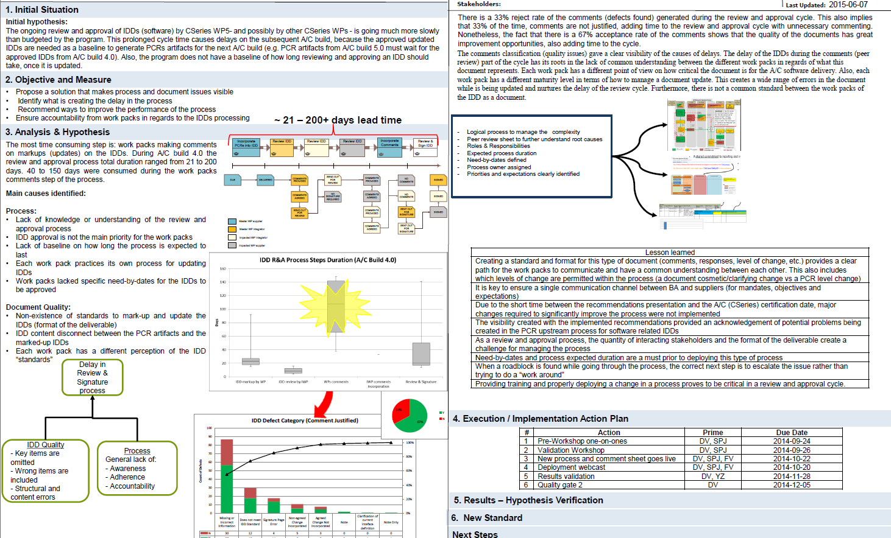
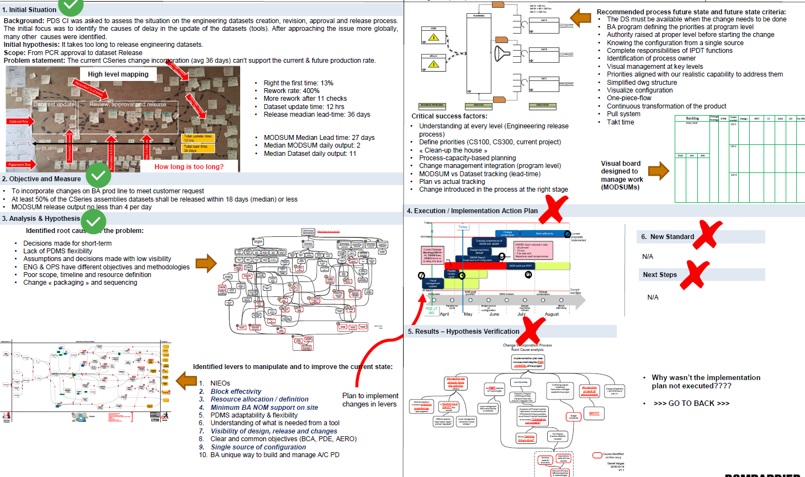
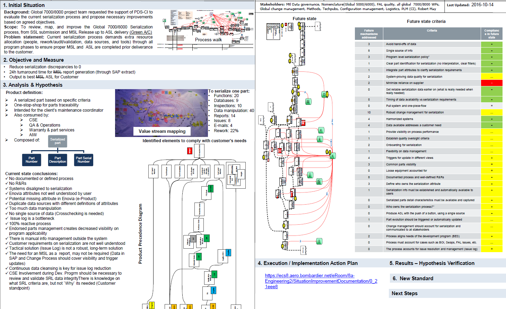

# Industrial Engineer

## Projects

### Lean Six Sigma

- Software interface definition documents (IDD) for aircraft builds: lead time reduction from 40 to 30 days, rework rate 
reduced from 33% to 7%.

---

- Structures dataset release process: first time right rate from 13% to 71%, lead time reduced from 26days to 19 days.

---

- Aircraft serialization process: discrepancies from 50% to 0%, ASL 24hr generation turnaround, total manual operations 
reduced from 111 to 57.

